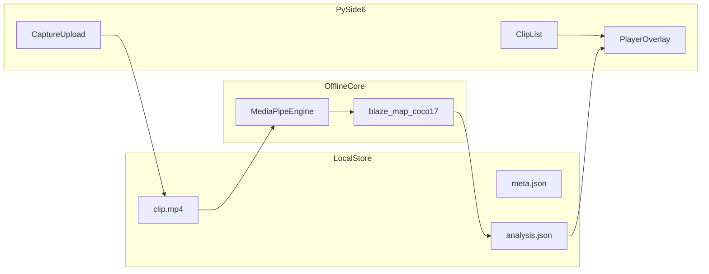

# Windows 客户端实现规格

离线桌面客户端：三个界面、本地媒体库、最长 2 分钟规范化、后台 MediaPipe 姿态分析、播放时用 Core JSON 叠 COCO-17 骨骼。

技术栈：**Python 3.12 + PySide6**，复用 [`core/mediapipe_engine.py`](../../core/mediapipe_engine.py)。不上传云、不做滑雪评分、不用 YOLO 作为默认分析路径。

## 目标与边界

- 单帧契约：[`schemas/core_inference.py`](../../schemas/core_inference.py) 的 `CoreInferenceResult`（`skeleton: coco_17`，`backend_id: mediapipe_pose`）。
- 视频包装：[`schemas/clip_analysis.py`](../../schemas/clip_analysis.py) / [`schemas/clip-analysis.v0.json`](../../schemas/clip-analysis.v0.json)。
- 骨骼连线：[`docs/research/blazepose-coco17.md`](../research/blazepose-coco17.md)。
- 模型：`models/pose_landmarker_full.task`（`python scripts/download_pose_landmarker.py`）。已有分析结果不会自动升级，需重新分析。

## 技术选型

| 层 | 选择 |
| --- | --- |
| UI | PySide6 Widgets，`QStackedWidget` 三页 |
| 播放/叠加 | OpenCV 读帧 + QLabel；按 `t_ms` 对齐 overlay（比 `QMediaPlayer` 更易锁骨骼） |
| 规范化 | ffmpeg（PATH 或同目录）；图片用 OpenCV |
| 拍摄 | OpenCV `VideoCapture(0)` 预览/录像，停录后走同一规范化 |
| 分析 | `QThread` 调 `MediaPipeEngine.infer` |



## 本地数据模型

根目录：`%LOCALAPPDATA%/visual/library/`（环境变量 `VISUAL_LIBRARY` 可覆盖）。

```
library/{clip_id}/
  clip.mp4          # 视频唯一媒体；原片规范化后删除
  clip.jpg          # 仅 kind=image
  thumb.jpg
  meta.json
  analysis.json     # 仅 status=done
```

`meta.json`：

```json
{
  "clip_id": "uuid",
  "created_at": "2026-08-25T21:45:00-05:00",
  "display_name": "08/25/2026-21:45",
  "duration_ms": 83400,
  "width": 1280,
  "height": 720,
  "fps": 30.0,
  "kind": "video",
  "status": "pending",
  "error": null,
  "seed_box": null,
  "seeds": [],
  "play_start_ms": 0,
  "play_end_ms": null
}
```

- `display_name`：本地时区 **`MM/DD/YYYY-HH:mm`**（24 小时）。
- `kind`：`video` | `image`。
- `status`：`pending` | `processing` | `done`。导入后为待定；框人确认后处理中；失败时保持 `processing` 并写 `error`。
- `seed_box`：最早一帧人物框（兼容旧数据）。`seeds`：若干 `{t_ms, box}`，分析时在对应时刻重锚定 ROI。
- `play_start_ms` / `play_end_ms`：逻辑播放与分析区间，不改 `clip.mp4`。刷新时清空。

`analysis.json`（视频）见 clip-analysis schema：`frames[].t_ms` + `frames[].result`（完整 `CoreInferenceResult`）。图片同样用该包装，`frames` 长度为 1。

采样：规范化后时间轴，**每 2 帧**（约 15 Hz overlay；播放时持有最近一帧结果）。

## 界面

### 列表

工具栏：拍摄、上传。行：`thumb.jpg`、名称、时长（`m:ss`，图片 `--`）、状态「待定 / 处理中 / 处理完毕」、**刷新**、**删除**。

- `pending` 点击进入准备页：进度条任意帧拖框（可多帧）、标记入/出点，确认后才分析。
- 仅 `done` 可进播放；`processing` 提示尚未完成。
- **刷新**：删掉 `analysis.json` 和 `seed_box`，状态回到「待定」，下次点击须重新框人。处理中禁用刷新。
- **删除**：确认后移除整个 `library/{clip_id}/` 目录。
- 拍摄 → 拍摄页；上传 → 文件对话框后进入预处理（超长则剪切）。
- Worker 完成分析后刷新该行。

### 上传 / 拍摄

- 拍摄：摄像头预览，开始/停止；停后预处理；删除临时原片。
- 上传：本地视频或图片。
- 视频 > 120s：剪切对话框（入/出点，窗口 ≤ 120s）。
- ffmpeg：高度 ≤ 720、30fps、H.264 yuv420p、无音轨、`-t 120`。
- 图片：高度 720 JPEG。
- 写 `meta.json`（`pending`）后回列表，**不入队**；点击条目框人后才分析。
- 返回：未确认则不建条目。

### 播放

- 视频按 `position`/`t_ms` 叠骨骼；图片静态 + 单帧 overlay。
- 可见度 ≥ 0.3 画 COCO-17 边。
- 返回列表，不删文件。

## 代码布局

```
clients/windows/
  app.py
  ui/list_page.py
  ui/capture_page.py
  ui/player_page.py
  ui/trim_dialog.py
  store/library.py
  pipeline/normalize.py
  pipeline/analyze.py
  overlay/skeleton.py
  README.md
```

依赖：PySide6、OpenCV、mediapipe、系统 ffmpeg。

## 验收

1. 超过 2 分钟的视频必须剪切后才能保存。
2. 库中只有规范化媒体，无原片。
3. 新条目先「处理中」，完成后「处理完毕」且有 `analysis.json`。
4. 播放时骨骼随时间对齐画面。
5. 列表名为 `08/25/2026-21:45` 形式。
6. 模型已在本地时无网络请求。
