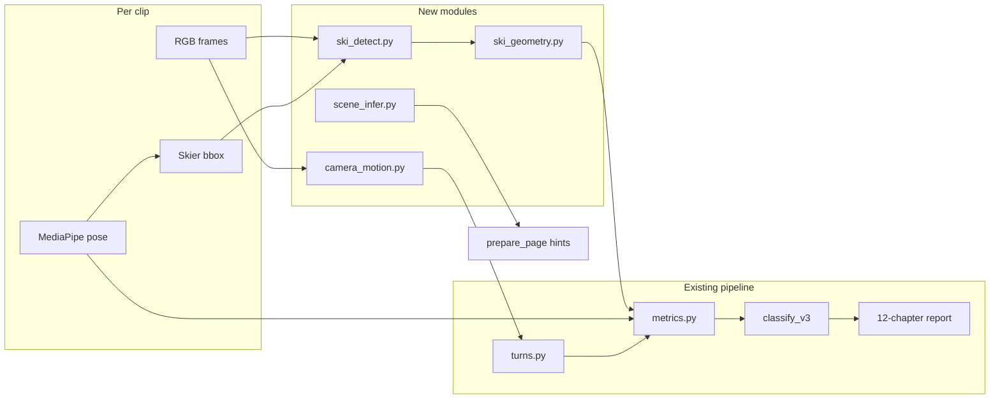

# Ski CV Optimization — Camera Motion, Ski Detection, Scene Prefill

Status: approved for implementation (P0–P3)
Date: 2026-08-31
Builds on: [`2026-08-30-ski-report-v3-design.md`](2026-08-30-ski-report-v3-design.md)

## 0. Why this spec

v3 classification and metrics work on quarter-view piste clips, but three failure modes remain visible in production:

1. **Follow-cam steering inflation** — hip tangent mixes skier and camera motion; `turn_amplitude` can exceed 100° on otherwise clean parallel runs (clip `b97c92dd`, fixed 2026-08-31 via θ clip + parallel stance exclusion, but root cause persists).
2. **Foot-index wedge noise** — `wedge_angle` from ankle→foot_index carries 8–10° systematic error in quarter view; enough to trigger wedge-family scores on parallel stance.
3. **Hard-coded classifier heuristics** — parallel-vs-wedge exclusion lives in Python constants, not curriculum; ambiguous classification is computed but not surfaced in Summary/List UI.

This spec defines four implementation tracks, cross-platform constraints, data collection, and acceptance criteria. **Primary breakthrough: ski board tip/tail detection (Track B, P1b).**

---

## 1. Constraints (confirmed)

| Constraint | Implication |
|---|---|
| Cross-platform | Algorithm source in [`core/sports/`](../../core/sports/); Windows first; iOS/Android port via shared fixtures |
| Client offline | CPU/GPU on device; OpenCV flow, MediaPipe, ONNX Runtime; no cloud inference |
| Scene tier v1 | Prepare page **suggested** chips only; user confirms before scene-gated levels apply |
| Honest limits | 2D visual wedge MAE target ±5° (enough for pizza vs parallel); no FIS-grade edge scoring claim |

---

## 2. Baseline (already shipped)

| Change | File |
|---|---|
| Steering θ clip ±50°, p90 amplitude | [`core/sports/turns.py`](../../core/sports/turns.py) |
| Pizza wedge gate 8°→12° | [`core/sports/bands.py`](../../core/sports/bands.py) |
| Pizza gate adds `stance_width`, `wedge_angle` | [`content/ski/curriculum.v3.json`](../../content/ski/curriculum.v3.json) |
| Parallel stance rejects wedge family | [`core/sports/classify.py`](../../core/sports/classify.py) |

Current capability gaps (unchanged from design §11):

| Module | Today | Primary file |
|---|---|---|
| Camera motion | hip ÷ leg heuristic; reliability 0.4 | [`metrics._infer_camera_motion`](../../core/sports/metrics.py) |
| Wedge angle | ankle→foot_index 2D | [`build_series`](../../core/sports/metrics.py) |
| Stage exclusion | Python constants | [`classify.py`](../../core/sports/classify.py) |
| Ambiguous UI | Chapter 2 only | [`report_panel.py`](../../clients/windows/ui/report_panel.py) |
| Scene | User hand-picks on Prepare | [`prepare_page.py`](../../clients/windows/ui/prepare_page.py) |

---

## 3. Architecture target



---

## 4. Track A — Camera motion compensation (P1c / P3)

### 4.1 Problem

Follow-cam: background and skier move together in image space. Steering tangent ≈ camera pan + turn curvature.

### 4.2 Method (A1)

New [`core/sports/camera_motion.py`](../../core/sports/camera_motion.py):

- **Input:** frame sequence, human bbox mask (hip/ankle hull)
- **Output:** per-frame 2×3 affine or 3×3 homography `H_t`, `motion_class` ∈ {static, pan, follow}, `flow_quality` ∈ [0, 1]
- **Algorithm:** Shi-Tomasi corners outside bbox → Lucas-Kanade flow → RANSAC global transform; follow = background motion anti-correlated with hip displacement

**Compensation:** apply `H^{-1}` to hip/ankle pixels before [`steering_signal`](../../core/sports/turns.py). If follow and low flow quality: multiply `turn_rate`, `turn_amplitude`, `turn_shape_index` reliability by 0.5; retain filming warning.

### 4.3 Integration (A2, P3)

- `tangent_source=compensated` in turn pack metadata
- Metric-level `blocked` reason `camera_follow_unreliable` when design §2.2 says turn_freq invalid
- Fixtures: [`tests/fixtures/camera_motion/`](../../tests/fixtures/camera_motion/) + clip `b97c92dd`

### 4.4 References

- SkiTraVis (arXiv:2304.02994) — keypoint + RANSAC perspective compensation
- PACE / WHAM / HAC — research reserve only (A3)

---

## 5. Track B — Ski detection (P1b core)

### 5.1 Problem

`wedge_angle` from foot_index is not the coach's wedge. Literature and products (Fohrmann Sensors 2019, Poser.pro) use **ski tip→tail vectors**.

### 5.2 New metrics

Register in [`content/ski/knowledge/metrics.json`](../../content/ski/knowledge/metrics.json):

| Metric id | Definition | Replaces / complements |
|---|---|---|
| `ski_wedge_angle` | angle(vec_L, vec_R) from board axes | Primary gate signal vs `wedge_angle` |
| `ski_parallelism` | 1 − normalized_wedge (0=wedge, 1=parallel) | Parallel / exclusion rules |
| `edging_similarity` | sync of inner/outer board vector at turn initiation | Poser-style; P2 |
| `ski_detect_ok` | fraction of frames with conf ≥ threshold | Fallback trigger |

When `ski_detect_ok` is false → fall back to **B0** shin/knee composite wedge (P1a).

### 5.3 Geometry (pure functions)

[`core/sports/ski_geometry.py`](../../core/sports/ski_geometry.py) — no ML:

- `mask_axis_endpoints(mask) -> (end_a, end_b, confidence)`
- `split_ski_masks(combined_mask) -> left, right` (connected components + pose-guided assignment)
- `ski_wedge_angle_deg(vec_l, vec_r) -> float`
- `assign_tip_tail(endpoints, hip_forward_hint) -> (tip, tail)` — P2; wedge angle invariant to flip in B1

### 5.4 Detection module (P1b MVP)

[`core/sports/ski_detect.py`](../../core/sports/ski_detect.py):

- **Input:** RGB frame, skier bbox
- **Output:** `{tip, tail, confidence}_{L,R}`, `ski_detect_ok`
- **Model v1:** tiny U-Net / MobileNet encoder on WSESeg alpine masks → ONNX (~2–5 MB)
- **Inference:** ONNX Runtime (Windows CPU/DirectML); later CoreML / NNAPI
- **Fallback:** B0 proxy when confidence low or view profile

### 5.5 Training data

| Source | Size | Use |
|---|---|---|
| [WSESeg CBMI 2024](https://doi.org/10.1109/cbmi62980.2024.10859243) | 7452 instance masks | Pretrain segmenter; baseline via mask→PCA |
| Self-collected tip/tail labels | 50–100 frames, quarter view | Fine-tune / evaluate MAE |
| In-app corrections | ongoing | Optional «fix ski tip» UI (B3) |

Baseline experiment: [`scripts/ski_baseline_wseseg.py`](../../scripts/ski_baseline_wseseg.py)

### 5.6 Classification changes

- [`bands.py`](../../core/sports/bands.py): pizza gate binds `ski_wedge_angle`; parallel adds `ski_parallelism >= 0.7`
- [`curriculum.v3.json`](../../content/ski/curriculum.v3.json) `exclusion_rules`: e.g. `ski_parallelism > 0.8` → reject wedge family
- Keep `wedge_angle` for backward compatibility and fallback

### 5.7 Acceptance (P1b)

| Criterion | Target |
|---|---|
| Quarter-view `ski_wedge_angle` MAE vs coach labels | < 5° |
| Parallel clip false pizza rate | 0 on validation set (incl. `b97c92dd`) |
| Inference time per frame (720p crop) | < 30 ms CPU on mid-tier laptop |
| Model size | < 5 MB ONNX |

### 5.8 Risks

| Risk | Mitigation |
|---|---|
| Board occluded by snow | Low conf → B0 fallback; filming hint |
| Low contrast (grey board) | Segmentation not edge-based |
| Profile view / overlapping skis | `view_too_profile` gate; skip ski detect |
| Pure vision edge ±5–10° | Stage classification only |

### 5.9 References

- Fohrmann et al., Sensors 2019 — monocular body + ski orientation, lean ±3.8°
- Ludwig et al., WACVW 2023 — ski tip/tail keypoints
- WSESeg CBMI 2024 — public mask dataset
- SkiSense (no skis) — negative reference

---

## 6. Track B0 — Shin/knee wedge proxy (P1a, interim)

Until P1b model ships, change internal `wedge_angle` aggregate to weighted median:

- shin + thigh + foot_index; foot weight ↓ as `azimuth_deg` → profile
- Does **not** replace `ski_wedge_angle` long term

---

## 7. Track C — Exclusion rules in curriculum (P0)

Add `exclusion_rules` to [`curriculum.v3.json`](../../content/ski/curriculum.v3.json):

```json
{
  "when": {"stance_width_lte": 0.37, "wedge_angle_lte": 10},
  "reject_levels": ["pizza_glide", "pizza", "wedge_christie"],
  "reason": "parallel_stance_detected"
}
```

[`classify.score_candidates`](../../core/sports/classify.py) evaluates rules; Python constants become fallback defaults.

Tests: [`tests/test_curriculum_v3.py`](../../tests/test_curriculum_v3.py), [`tests/test_report_audit.py`](../../tests/test_report_audit.py).

---

## 8. Track D — Ambiguous UI (P0)

When `Classification.ambiguous` and `confidence < 0.35`:

- **Summary:** title `Possible stage` + top-2 names; score ring labeled as leading candidate
- **List row:** chip `Parallel?` or dual abbreviation
- i18n keys in [`locales/strings.json`](../../locales/strings.json) (min `zh`)

---

## 9. Track E — Scene prefill (P2)

[`core/sports/scene_infer.py`](../../core/sports/scene_infer.py):

```python
def infer_scene_hints(pack: MetricPack) -> SceneHints:
    """Rule-based snow_surface / terrain_type suggestions; confidence < 0.5 → no prefill."""
```

Features: COM vertical travel, knee flex rhythm, edge proxy variance, turn amplitude stability, background GLCM (bbox exterior).

Prepare page shows suggested chips; **does not** alter classify until user confirms.

---

## 10. Data collection (parallel)

| Dataset | Count | Purpose |
|---|---|---|
| Follow vs static camera pairs | 10 + 10 clips | Camera motion validation |
| Ski tip/tail labels | 50–100 frames | P1b MAE / fine-tune |
| Scene labels | 20 clips | Scene prefill |
| Ambiguous clips | all conf < 0.35 | UI + rule tuning |
| Ski detect failures | curated | Fallback policy |

Annotation format: [`content/ski/annotations/schema.json`](../../content/ski/annotations/schema.json)

---

## 11. Priority and milestones

| Phase | Track | Deliverable | Est. |
|---|---|---|---|
| **P0** | C + D | Data-driven exclusion + ambiguous UI | 2–3 w |
| **P1a** | B0 | Shin/knee wedge fallback | 2 w |
| **P1b** | B1 | WSESeg baseline + ski_geometry + tip/tail labels + `ski_wedge_angle` | 4–6 w |
| **P1c** | A1 | `camera_motion.py` + sparse flow | 4–6 w |
| **P2** | B2 + E | Temporal filter, edging_similarity, scene prefill | 3–4 w |
| **P3** | A2 | Compensated steering + metric block | 2–3 w |
| **P3** | B3 | User tip correction + retrain loop | ongoing |

**Immediate start (2026-08-31):** spec (this doc) + P1b WSESeg baseline script + self-clip annotation schema.

---

## 12. Verification

Before each track merges:

```bash
python scripts/verify_v3.py
pytest tests/test_ski_geometry.py tests/test_curriculum_v3.py tests/test_report_audit.py
```

Cross-platform: export numeric fixtures for Swift/Kotlin parity (design §10 step 5–6).

---

## 13. Open questions

1. **WSESeg access** — confirm download URL / license with dataset authors; store under `data/ski/wseseg/` (gitignored).
2. **ONNX export toolchain** — PyTorch training repo location (monorepo vs submodule).
3. **Mobile ski overlay** — defer player overlay of board vectors to P2 after Windows validates geometry.
